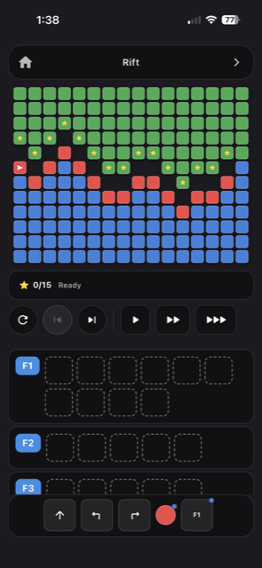
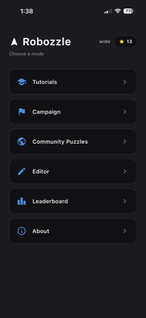
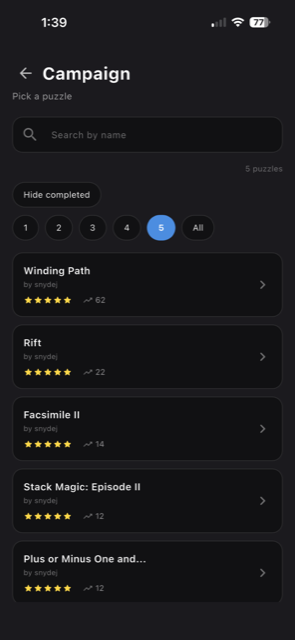
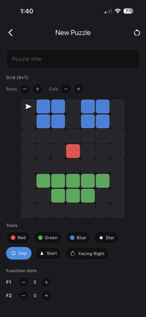

# Robozzle Reboot

A Flutter recreation of Robozzle: program a robot with a small instruction
set (move, turn, paint, call one of 5 subroutines) — each instruction can
be conditioned on the color of the tile the robot is standing on — to
collect all the stars on a grid.

<p align="center">
  
</p>

<p align="center">
  
  
  
</p>

## Project layout

- `lib/models/` — pure Dart data types: grid tiles, tile colors, directions,
  instructions, levels, and the player's program. No Flutter dependency, so
  these are easy to unit test.
- `lib/engine/interpreter.dart` — the actual game logic: steps through the
  program one instruction at a time, handles movement, painting, star
  collection, subroutine calls, crash detection, and an infinite-loop guard.
- `lib/data/levels.dart` — built-in levels, authored as simple ASCII grids.
- `lib/widgets/` — the grid/robot renderer, the instruction palette, and the
  function (F1–F5) editor rows.
- `lib/screens/game_screen.dart` — wires it all together: level selection,
  tap-to-place program editing, run/step/reset controls.
- `test/interpreter_test.dart` — unit tests covering movement, crashing,
  color conditionals, painting, subroutine calls, the infinite-loop guard,
  and a full solve of the built-in "Around the Corner" level.

## How the game works right now

To build a program: tap an instruction (or the color dot for a condition)
in the bottom palette, then tap a slot in the F1/F2 row above it to place
it there. Tap the eraser, then a slot, to clear it. Use Step to advance one
instruction at a time, or Run to animate continuously. Reset restarts the
level with the same program.

## Running it

You said you already have Flutter + Xcode set up, so:

```
cd Robozzle-2.0
flutter pub get
flutter test        # run the unit tests
flutter run         # launch on a simulator or connected device
```

If `flutter run` shows a device chooser, pick an iOS Simulator (or run
`open -a Simulator` first, then `flutter run`).

## Where to go from here

Ideas for extending this, roughly in order of effort:
- More levels (just add more ASCII grids to `lib/data/levels.dart`).
- A proper level-complete screen / star rating.
- Drag-and-drop instead of tap-to-place for building programs.
- A simple level editor so you can design your own puzzles in-app.
- Persisting solved levels / best instruction counts (e.g. with
  `shared_preferences`).
